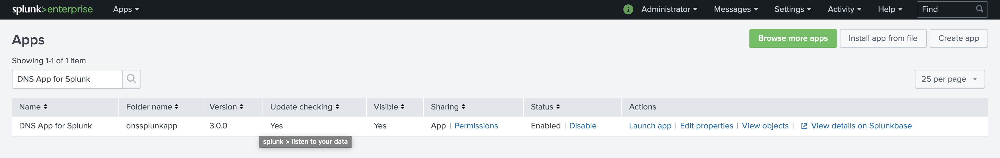
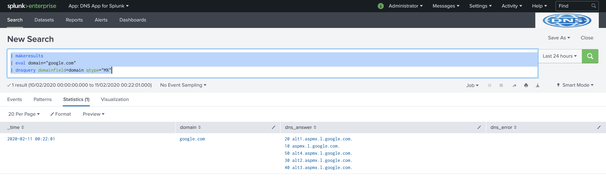
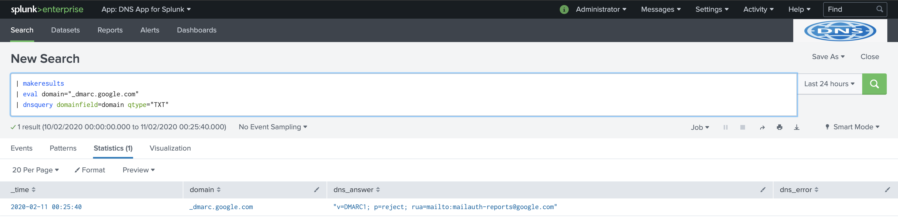

# athena-dnssplunkapp

## Introduction
An app based on the DNSPython package in python which adds commands to run DNS queries of different types such as MX, TXT, CNAME, A

## Setup
Note that the instructions below assume that `athena-dnssplunkapp` has been git cloned in the /opt directory on a Linux host.

## Install Splunk Docker container (Optional)
Optional step to setup a Splunk environment for testing. If you already have a Splunk Search-head/indexer, this step is not required.

* Pull Docker image

```
docker pull splunk/splunk:latest
```

* Build the container with password `Splunk123$`

```
docker run -v /opt/athena-dnssplunkapp:/opt/athena-dnssplunkapp -d -p 8000:8000 -e "SPLUNK_START_ARGS=--accept-license" -e "SPLUNK_PASSWORD=Splunk123$" --name splunk splunk/splunk:latest
```

### Install App
Install the Splunk App by downloading the `.tar.gz` file from the Releases section of this repository.

Once the app is installed, restart Splunk instance from `Settings` > `Server Controls`

The app should now appear within the `Manage Apps` section in Splunk under `Apps` > `Manage Apps` option in the top-bar in Splunk.



## Testing the App - Examples

### Example 1: Getting MX records for a domain
Go to the DNS App for Splunk app, and run the query to get the `MX` records for the domain `google.com` and write to a new field `dns_answer_mx` instead of the default field `dns_answer`:
```
| makeresults
| eval domain="google.com"
| dnsquery domainfield=domain qtype="MX" answerfield="dns_answer_mx"
```



### Example 2: Getting TXT/DMARC records for a domain
To get the `DMARC` record for the domain `google.com` which is obtained by getting `TXT` for the domain `_dmarc.google.com`, run the command:

```
| makeresults
| eval domain="_dmarc.google.com"
| dnsquery domainfield=domain qtype="TXT"
```



### Example 3: Get IP address for hostnames in the lookup file

To get the IP addresses for the hostnames specified under the field `domain` an inputlookup file called `domains.csv`, run the command:
```
| inputlookup domains.csv
| dnsquery domainfield=domain qtype="A"
```

### Example 4: Get Domain name for the IP Address via PTR
Get the domain name for `8.8.8.8` IP address by specifying the ARPA address, run the search for `PTR` record as per below:
```
| makeresults
| eval domain="8.8.8.8.in-addr.arpa"
| dnsquery domainfield=domain qtype="PTR"
```

## Tested Record Types
The following record types have been tested to work:
* A
* AAAA
* CNAME
* MX
* PTR
* TXT (DMARC)

Note that the app may well work for other record types as well. 

## Viewing progress
To view the progress of the dnsquery commands run on piped-input, run the following search query:
```
index=_internal source=*dnsquery*
```

## App On Splunkbase
This App has been submitted on Splunkbase and is located [here](https://splunkbase.splunk.com/app/4879/).

## Development/Contributing 
This section provides misc references/tips that were used in development for this application:

### To login as root user inside splunk container
Use sudo with the following command:
```
sudo -u splunk /bin/bash 
```

### To install the app
Install the app as follows: 
```
cp -r /opt/athena-dnssplunkapp/dnssplunkapp /opt/splunk/etc/apps/
```

### To execute commands as a splunk user
The following steps will execute command `whoami` as a `splunk` user
```
sudo /bin/bash
    $SPLUNK_HOME/bin/splunk cmd whoami
```

### Packaging the App 
To package the app, we use `slim` tool through the following command which also the generates the app manifest automatically:
```
/opt/splunk/bin/slim package dnssplunkapp
```

### References
The following references were used to develop this app:
* (Creating Custom Search Command)[https://dev.splunk.com/enterprise/docs/developapps/customsearchcommands/createcustomsearchcmd/]
* (Create custom search commands for apps or add-ons in Splunk Enterprise)[https://dev.splunk.com/enterprise/docs/developapps/customsearchcommands/]
* (Testing Custom Splunk Commands inside/outside Splunk)[https://www.splunk.com/en_us/blog/tips-and-tricks/building-custom-search-commands-in-python-part-i-a-simple-generating-command.html]

